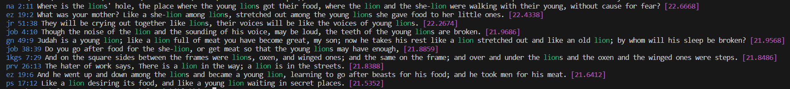

# Elasticsearch Primer

## Library

### Create the Elasticsearch Docker container 

```docker
docker network create elastic
docker run --name elasticsearch --net elastic -p 9200:9200 -it -m 4GB elasticsearch:8.12.0
```

Check the logs for the HTTP basic auth user `elastic`.

Next, create the index with a `PUT` request found in `resources/index/create_index_with_analyzer.json`.

## Import

### Build the importer

Add the ES connection details and *password* for connecting to `https://localhost:9200`.

```bash
cd src/elasticbible/import
go build -o ../../../bin/import.exe .
```

### Run the importer

```bash
cd bin/
./import -file="../resources/data/en_bbe.json" -host="https://localhost:9200" -username="elastic" -password="somepassword" -index="bible"
```

## Search

### Build the searcher

```bash
cd src/elasticbible/search
go build -o ../../../bin/search.exe .
```

### Run the searcher

Set some env vars for convenience:

```bash
export ES_HOST=https://localhost:9200
export ES_INDEX=bible
export ES_USERNAME=elastic
export ES_PASSWORD=somepassword
export MAX_RESULTS=20
```

```bash
cd bin/
./search -host="https://localhost:9200"  -index="bible" -username="elastic" -password="somepassword" -text="adam" -max=30
```

Command:

```bash
./search -host="https://localhost:9200"  -index="bible" -username="elastic" -password="somepassword" 
-text="lion" -max=10
```

Example results (without colouring):

```
na 2:11 Where is the lions hole, the place where the young lions got their food, where the lion and the she-lion were walking with their young, without cause for fear? [22.6668]
ez 19:2 What was your mother? Like a she-lion among lions, stretched out among the young lions she gave food to her little ones. [22.4338]
jr 51:38 They will be crying out together like lions, their voices will be like the voices of young lions. [22.2674]
job 4:10 Though the noise of the lion and the sounding of his voice, may be loud, the teeth of the young lions are broken. [21.9686]
gn 49:9 Judah is a young lion; like a lion full of meat you have become great, my son; now he takes his rest like a lion stretched out and like an old lion; by whom will his sleep be broken? [21.9568]
job 38:39 Do you go after food for the she-lion, or get meat so that the young lions may have enough, [21.8859]
1kgs 7:29 And on the square sides between the frames were lions, oxen, and winged ones; and the same on the frame; and over and under the lions and the oxen and the winged ones were steps. [21.8486]
prv 26:13 The hater of work says, There is a lion in the way; a lion is in the streets. [21.8388]
ez 19:6 And he went up and down among the lions and became a young lion, learning to go after beasts for his food; and he took men for his meat. [21.6412]        
ps 17:12 Like a lion desiring its food, and like a young lion waiting in secret places. [21.5352]
```

